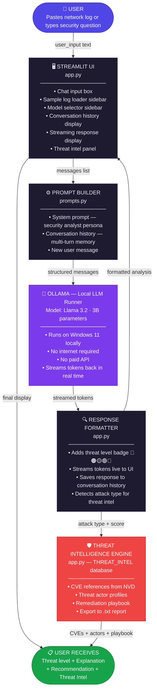
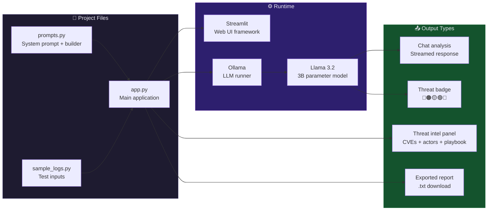
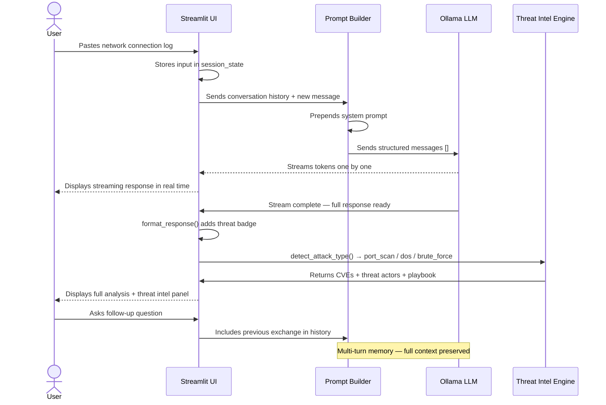
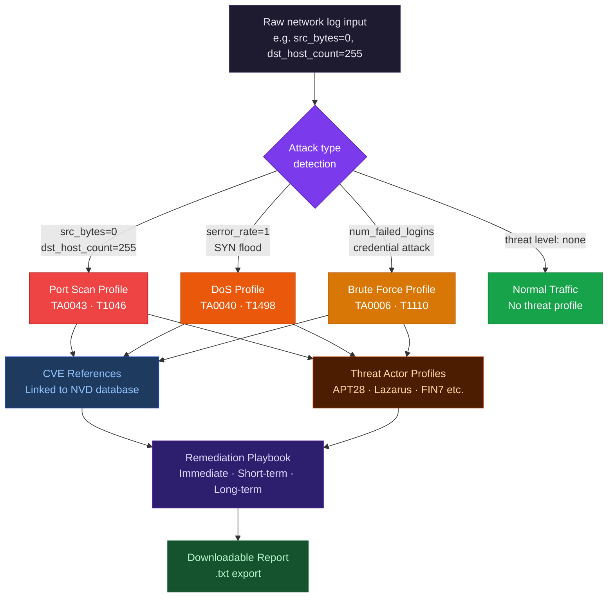

# Application Workflow Diagram
## CAP 942 — Security Log Analyst Chatbot

---

## System Flow

---

## Component Breakdown

---

## Data Flow — Step by Step

---

## Threat Intelligence Flow

---

## Tools and Libraries

| Component | Tool | Version | Purpose |
|---|---|---|---|
| LLM runner | Ollama | Latest | Run Llama 3.2 locally on Windows 11 |
| Language model | Llama 3.2 (3B) | Meta open-source | AI security analysis |
| Web UI | Streamlit | Latest | Chat interface and threat intel panel |
| LLM client | ollama (Python) | Latest | API calls to local Ollama server |
| Language | Python | 3.11 | Application code |
| Package manager | uv | Latest | Fast dependency management |

---

#